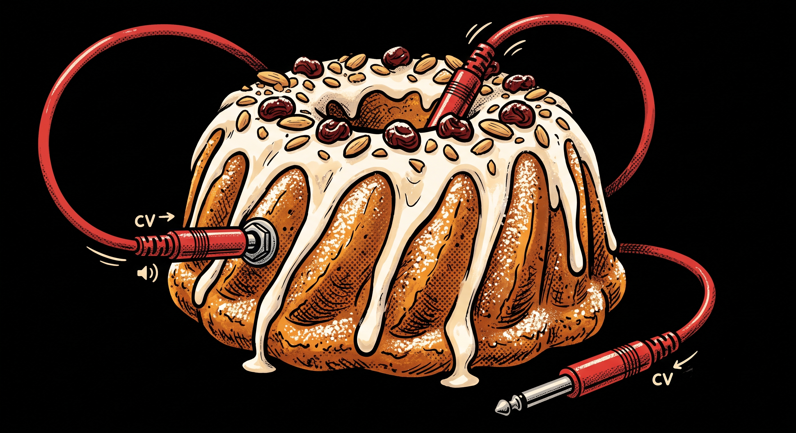
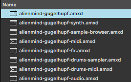

# m4l-gugelhupf

**Max for Live devices** that bring [Strudel](https://strudel.cc) - the JavaScript port of TidalCycles' pattern language - natively into Ableton Live. 

Bring generative sequencing, euclidean rhythms, and algorithmic composition directly into your Ableton Session.

[Download Latest Release](https://github.com/alienmind/m4l-gugelhupf/releases/latest) | [Get it on Gumroad](https://alienmindzzz.gumroad.com/l/m4l-gugelhupf-devices)

---

## New in 1.3.0

- **Export lands in a clip.** Press Export and the pattern is rendered and dropped straight into the highlighted clip slot - warped, and looped over exactly the cycles that were rendered, so it plays in time rather than being warped by guess. The copy-the-path-and-drag-it-in dance is gone.
- **A new device: Gugelhupf Audio.** The same device, the same Studio, the same pattern - as an *audio effect*, so it sits on an audio track. Live only puts an audio clip on an audio track, so this is the flavour that bounces into the track it is already on. On a MIDI track the instrument still writes the file and offers one button, which makes a new audio track and puts it there.
- **On a MIDI track, Export also writes a MIDI clip.** The main device on a MIDI track cannot make an audio clip, but it can make a MIDI one: press the notes button and the pattern's notes go into the first empty slot on the track. It is the same conversion the Gugelhupf MIDI device does, so everything Strudel can do to notes - `.transpose()`, `.arp()`, `.jux()`, full JS - comes through. Samples (`s("bd sd")`) and effects have no MIDI form and are dropped.
- **A transport Follow switch**, and bouncing turns it off. A clip in the track is the pattern already recorded; leaving the pattern following Live's Play as well would sound both at once. Follow is a real Live parameter, so it is automatable, mappable and saved with your set.
- **"Copy folder path" works before you have exported anything.** The button used to appear only once a file had been written, which made it useless on a device whose Export was failing - exactly when you want to go and look in the folder. It now follows the device folder, which is known as soon as the device loads.

## New in 1.2.0

- **The Studio is the instrument.** The Gugelhupf device's sound is no longer made in the device view: it is made by a full local strudel.cc app running in a floating window. Its editor, its scheduler, its superdough, its visualisers. Evaluating a pattern there is what the track plays, and closing the window does not stop it.
- **A pattern can describe a dial.** `note("c3 e3").s("sawtooth").lpf(m4lKnob(1, { name: 'cutoff', unit: 'Hz', range: [200, 2200] }))` binds directly to native dials, scaling values correctly.
- **Three faces on the device view.** The device view now has a visualizer (fed by the window's level), a bank of vertical faders carrying whatever the pattern named, and a code editor over the same pattern the Studio holds.
- **Native panel.** Play alone on the top row, then two rows of four dials.

---

## What's in the box

### The Main Instrument: Strudel

The primary deliverable is **Gugelhupf** (`alienmind-gugelhupf`, called `alienmind-gugelhupf-superdough` before 1.0.0). This instrument understands the full Strudel language and uses the real `@strudel/superdough` engine to natively produce sounds (synths, oscillators, samples) and effects, perfectly in sync with Ableton's transport clock.

> ⚠️ **Experimental Limitations:** superdough now runs LIVE in the device, so edits and knob turns are audible immediately and there is no loop boundary to wait for. What remains:
> - **No MIDI in:** it sequences its own pattern rather than playing notes you send it. For that, use **Gugelhupf Synth**.
> - **Freeze does not work:** Live freezes a track offline, and this device's sound comes from a live browser engine. Use **Export**, or resample the track.
> - **Timing can wobble:** the page's audio clock and Live's transport are two clocks, and a heavy set can pull them apart.

### The Micro Devices

We also deliver a set of specialized, lightweight devices - some translating Strudel into native Ableton MIDI or Max DSP, some making sound of their own:

| Device | Type, drop it on | What it does for you |
|---|---|---|
| **Gugelhupf Synth** | Instrument, **MIDI track** | Type a SOUND (`s("sawtooth").lpf(800)`) instead of a pattern, and every MIDI note the track sends plays it. |
| **Gugelhupf MIDI** | MIDI effect, **MIDI track** | Type a Strudel pattern, press **Run**, and it streams live MIDI into whatever instrument sits after it. Also converts patterns **to and from MIDI clips**. |
| **Gugelhupf Drums MIDI** | MIDI effect, **MIDI track** | The same generative power as Gugelhupf MIDI, focused on drums. Visual **Kit** mapper routes drum words (`bd`, `sd`) directly to Drum Rack pads. |
| **Gugelhupf Drums Sampler** | Instrument, **MIDI track** | A code-driven drum sampler. Write `s("bd sd, hh*8")`, pick a drum machine **bank**, and it plays that machine's sounds. |
| **Gugelhupf Audio** | Audio effect, **audio track** | The main device on an audio track: same Studio, same pattern, same knobs, and whatever the track carries passes through with the pattern added. The one flavour that can **bounce its pattern into a clip** on its own track. |
| **Gugelhupf Audio FX** | Audio effect, **audio track** | Type a single line of Strudel's DSP effect vocabulary (e.g., `.lpf(800).gain(1.2)`) and it generates a real Max signal chain on the track. |
| **Gugelhupf Samples** | Instrument, **MIDI track** | Browse Strudel's sample-map universe. Audition samples beat-synced to your project and drag them straight into a Drum Rack. |

They are meant to be combined. The chain below is the whole idea in one track: **Gugelhupf MIDI** sequences the notes (`<c3 c3 <c3 c#3>>*16`), **Gugelhupf Synth** turns each one into sound (`s("sawtooth")`), and **Gugelhupf Audio FX** filters the result (`.lpf(6613)`). Every line is Strudel; every knob is a real, automatable Live parameter.

---

## Why a producer would care

- **Generative sequencing in one line.** `note("c3 e3 g3 b3").sometimesBy(.3, x=>x.fast(2))` is a whole evolving part. Euclidean rhythms, polymeter, per-cycle alternation - things that are tedious to click into a piano roll are one expression in Strudel.
- **It's really Live-native.** Patterns start on the bar, follow tempo automation, stop when you stop the transport, and notes land on the track the device sits on. 
- **From sketch to clip.** The MIDI device can freeze any pattern into a regular MIDI clip (and read clips back into mini-notation), so generative sketches become ordinary arrangeable material.
- **A sample library browser with taste.** The community sample maps behind strudel.cc (hundreds of drum machines, folk instruments, found sound) become browsable, beat-synced-previewable, and downloadable straight into your User Library workflow.

---

## Device Guide

### Strudel (`alienmind-gugelhupf.amxd`)
Type any Strudel pattern - whether it's synthesizers like `s("sawtooth")`, samples like `s("bd")`, or complex effect chains. Press **Run** and start Live's transport. The pattern plays live, as real track audio: it goes through the fader, the sends and the meters like any other instrument, and you can resample or record it.

**One limitation worth knowing: Freeze does not work on this device.** Live's Freeze renders a track offline and faster than real time, and the device's sound comes from a live browser engine that cannot run in that offline pass - so a frozen track goes silent. This is a property of how Live freezes, not something the device can work around. Two things do work, and either gives you the same result:

- **Export** (the download icon) renders the pattern to a `.wav` next to the device and puts it straight into a clip. Use **Gugelhupf Audio** on an audio track for that - it bounces into the slot you clicked. On a MIDI track the file is still written and one button offers a new audio track; **Copy folder path** (the clipboard icon) also still gives you the file's full path, which is the answer on Live 12.0.4 and older, where Live cannot make the clip.
- **Resample** the track onto an audio track while it plays, the normal Live way.

**Launching a clip on the track starts it.** You do not have to press Run as well: launch a clip on the device's track and the pattern starts; stop the clip and it stops. On a track with no clips at all, Live's global Play does the same job. Run and the mappable **Play/Stop** parameter still work, and whichever moved last wins.

### Gugelhupf Synth (`alienmind-gugelhupf-synth.amxd`)

The synth is the one device here that takes a **sound**, not a pattern. Type `s("sawtooth")`, add an envelope and effects (`.attack(0.2).lpf(800).room(.3)`), press the tick (or **Ctrl+Enter**), and every MIDI note the track sends plays that sound - from a clip, from your keyboard, or from a Gugelhupf MIDI device sitting in front of it.

There is no Play/Stop here on purpose: the notes are the trigger, so there is nothing to start.

Two things to know:
- **Structure collapses.** `s("<sawtooth square>")` is a pattern, and this device keeps only its first event. Patterns belong in the main Gugelhupf device.
- **Holding a key does not hold the note.** A note's length is decided when it starts, from `.sustain(seconds)` (0.6 s if you do not say). This is how the sound engine schedules a voice - the whole envelope goes in up front and cannot be cut short.

Any `slider()` in the sound (`.lpf(slider(1200, 100, 8000))`) binds to one of the eight native knobs (**S1..S8**), so you can automate the timbre or turn it from Push.

### Gugelhupf MIDI (`alienmind-gugelhupf-midi.amxd`)

Two workflows in one device:
- **Live mode (Run / Stop)** - evaluate real Strudel code and stream the result as live MIDI into whatever instrument sits after the device.
- **Clip mode (Clip)** - convert mini-notation to a regular MIDI clip on this track, and read clips back into mini-notation.

The editor features a native **Play/Stop** panel for macro-mapping, and a comprehensive **Help (?)** reference tailored to exactly what the device supports.

### Gugelhupf Drums MIDI (`alienmind-gugelhupf-drums-midi.amxd`)

Built for driving Drum Racks. Instead of writing absolute pitches, write Strudel drum words (`bd`, `sd`, `hh`). 

Clicking the **Kit** button opens a dedicated visual mapper to route Strudel's vocabulary directly to your Ableton Drum Rack pads (e.g. assigning `bd` to note `36`). These mappings are stored natively and save with your Live set.

### Gugelhupf Drums Sampler (`alienmind-gugelhupf-drums-sampler.amxd`)

A self-contained instrument that fetches and plays samples from **drum-machine banks** driven by Strudel code. 

1. **Pick a bank** from the dropdown (e.g. RolandTR909, AkaiLinn).
2. **Write a pattern**: `s("bd sd, hh*8")`.
3. Samples **download automatically** in the background the first time a sound is named.

You can also browse the selected bank's sounds via the **Sounds** screen and audition them directly through the track.

### Gugelhupf Audio FX (`alienmind-gugelhupf-fx.amxd`)

Brings Strudel's chainable DSP vocabulary to any audio track. Type a chain of Strudel effects, such as `.lpf(800).room(0.3).gain(1.2)`, and hit Enter. The parameters appear as **native Live dials** beside the text.

- **Native, not HTML**: the dials are real Live parameters - automatable, MIDI-mappable, and paged on Push.
- **Add Effect Menu**: clicking `(+)` opens an overlay to quickly append new DSP stages.

### Gugelhupf Samples (`alienmind-gugelhupf-sample-browser.amxd`)

A browser for the community sample maps behind strudel.cc. It is an instrument (it makes
the preview sound), so drop it on a MIDI track.
- Browse curated community sample maps (dough-samples, Dirt-Samples, clean-breaks).
- Audition samples beat-synced to your project's launch quantization.
- Drag the auditioned row straight into a Simpler, a Drum Rack, or an audio track.

---

## Troubleshooting

- **Updated the device but nothing changed** → Live embeds a copy of the device in your set when you drag it in. Delete the device from the track and re-drag it from the browser to update.
- **Run does nothing** → Check the status line says *Strudel engine ready* and remember: no sound until **Live's transport is playing**.
- **Red outline** → The message under the editor names the parse/eval error.
- **Load from Clip greyed out** → The track has no clips yet; Save to Clip makes one.
- **The sample list is empty after picking a map** → Check the status line for a fetch error (the maps come from the network).
- **No sound offline from `s("bd")`** → Samples are fetched when they play, so a sound has to have played online once. After that it is cached in the device and plays offline; synths (`s("sawtooth")`) never need the network.
- **The Synth is silent** → It plays incoming MIDI only. Check there is a clip or a controller sending notes to the track, and that the status line names your sound rather than showing a red error.